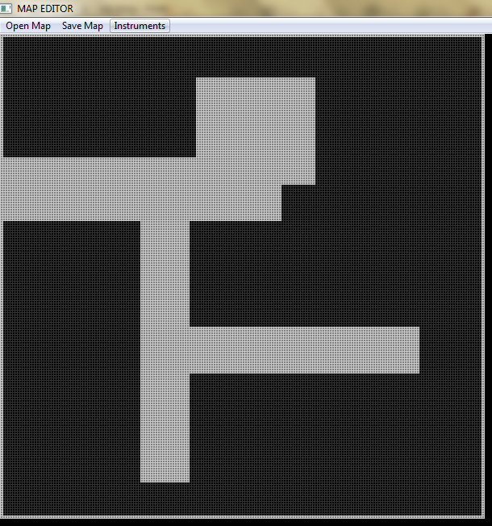

# snake
игра "змейка"

### Особенности
- написана без использования сторонних библиотек (только функции WinAPI)
- двойная буферизация (плавное обновление изображения на экране)
- бот (построение дерева возможных ходов для принятия решения)
- меню
- редактор карт

### Примеры:

<h4 align="center">
  
</h4>

<h4 align="center">
  
</h4>

<h4 align="center">
  
</h4>
